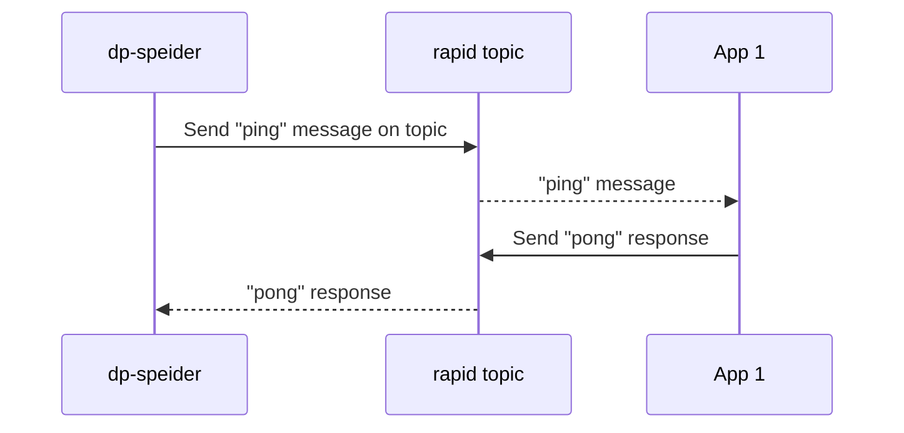

# dp-speider

Speider etter mikrotjenester som ikke oppfører seg.


## Hvordan?

dp-speider er en mikrotjeneste som speider etter andre mikrotjenester. Den sender en "ping" event i gitte intervaller i formatet: 

```json
{
  "@event_name": "ping",
  "ping-time": "2020-01-01T00:00:00.000+01:00"
}
```

der apper som mottar denne eventen skal svare med en "pong" event i formatet:

```json
{
  "@event_name": "pong",
  "ping-time": "2020-01-01T00:00:00.000+01:00",
  "pong-time": "2020-01-01T00:00:00.000+01:00",
  "app_name": "app-name",
  "instance_id": "instance-id"
}
```

dp-speider sender etter gitte intervaller en "app-status" event i formatet:

```json
{
  "@event_name": "app-status",
  "app": "app-name",
  "last_active_time": "2020-01-01T00:00:00.000+01:00",
  "status": "1", // 0 = inaktiv, 1 = aktiv
  "instances" : [
    {
      "instance_id": "instance-id",
      "last_active_time": "2020-01-01T00:00:00.000+01:00",
      "status": "1" // 0 = inaktiv, 1 = aktiv
    }
  ]
}
```

som [dp-doh](https://github.com/navikt/dp-doh) bruker for å varsle om inaktive apper til slack.

### Forenklet flytdiagram



## Komme i gang

Gradle brukes som byggverktøy og er bundlet inn.

`./gradlew build`

# Henvendelser

Spørsmål knyttet til koden eller prosjektet kan rettes mot:

* André Roaldseth, andre.roaldseth@nav.no
* Eller en annen måte for omverden å kontakte teamet på

## For NAV-ansatte

Interne henvendelser kan sendes via Slack i kanalen #team-dagpenger-dev.
